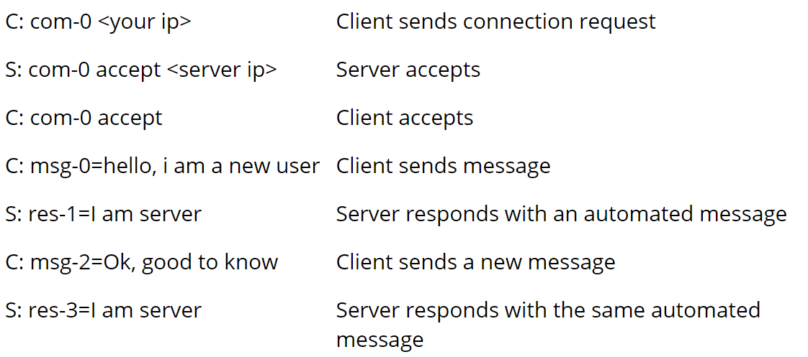

# TCP Subset Clone

A simplified version of the TCP protocol written in Python 3

## The protocol we had to follow

## Project Functionality

- [x] Implement three-way handshake between client and server
- [x] Check that we get the correct protocol message
- [x] Check that we get the expected message increment
- [x] Add idle tolerance before shutting down connection
- [x] Implement client options through config file
- [x] Save handshake etc in a log file
- [x] Try to bypass the protocol